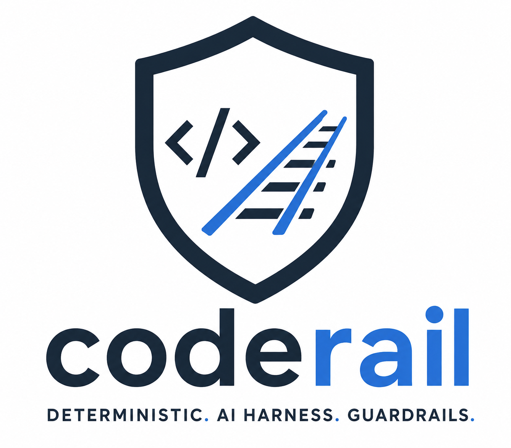

<p align="center">
  
</p>

<h1 align="center">CodeRail</h1>

<p align="center">
  <a href="https://github.com/james-d12/CodeRail/actions/workflows/ci.yml"></a>
  <a href="https://www.nuget.org/packages/CodeRail"></a>
  <a href="LICENSE"></a>
</p>

**CodeRail** is a deterministic quality-validation and orchestration layer for AI-assisted
software development.

It does not replace existing engineering tools such as [SonarCloud](https://www.sonarsource.com/products/sonarcloud/),
[Stryker](https://stryker-mutator.io/), coverage tooling, `dotnet test`, or
[CodeGuard](https://github.com/james-d12/CodeGuard). Instead it executes them, normalises their
results into a common evidence model, applies configurable quality policies, and hands an AI
coding agent a single deterministic PASS/FAIL verdict with actionable findings — so the agent can
iteratively repair a change until the quality gate passes, instead of declaring itself done.

See [`docs/HIGH_LEVEL_PLAN.md`](docs/HIGH_LEVEL_PLAN.md) for the full design.

## Installation

The CLI is published to nuget.org as a [.NET tool](https://learn.microsoft.com/en-us/dotnet/core/tools/global-tools):

```bash
dotnet tool install -g CodeRail
coderail --help
```

This installs the `coderail` command globally. Every example below works the same whether you run
it as `coderail <command>` after installing, or as `dotnet run --project src/CodeRail.Cli --
<command>` from a checkout of this repo.

### Standalone binaries

Each [GitHub Release](https://github.com/james-d12/CodeRail/releases) also publishes
self-contained, single-file native builds for Linux, macOS and Windows - no .NET SDK/runtime
install or `dotnet tool install` required just to launch `coderail` itself. These always carry the
exact same version as that release's NuGet package.

| Platform | Archive |
|---|---|
| Linux x64 | `coderail-<version>-linux-x64.tar.gz` |
| Linux arm64 | `coderail-<version>-linux-arm64.tar.gz` |
| macOS x64 (Intel) | `coderail-<version>-osx-x64.tar.gz` |
| macOS arm64 (Apple Silicon) | `coderail-<version>-osx-arm64.tar.gz` |
| Windows x64 | `coderail-<version>-win-x64.zip` |

Linux/macOS:

```bash
mkdir coderail && curl -L https://github.com/james-d12/CodeRail/releases/download/v<version>/coderail-<version>-<rid>.tar.gz | tar xz -C coderail
cd coderail
./coderail --help
```

Windows (PowerShell):

```powershell
Invoke-WebRequest -Uri https://github.com/james-d12/CodeRail/releases/download/v<version>/coderail-<version>-win-x64.zip -OutFile coderail.zip
Expand-Archive coderail.zip -DestinationPath coderail
cd coderail
.\coderail.exe --help
```

Two things to know about the standalone binaries:

- **macOS Gatekeeper**: the binary isn't code-signed/notarized, so macOS will refuse to run it on
  first launch ("cannot be opened because the developer cannot be verified"). Clear the quarantine
  attribute once after downloading: `xattr -d com.apple.quarantine ./coderail`.
- **`validate` still needs a .NET SDK installed**: `coderail` never loads anything like Roslyn's
  `MSBuildWorkspace` itself, but every step (`build`, `test`, `coverage`) shells out to a plain
  `dotnet` on `PATH` via `ProcessRunner` to validate the *target* repository. The self-contained
  binary removes the need to install the `coderail` tool itself via `dotnet tool install`, but not
  the underlying .NET SDK dependency for actually validating a .NET repo.

## Status

`validate` runs `dotnet build`, `dotnet test`, [CodeGuard](https://github.com/james-d12/CodeGuard),
coverage collection, [SonarCloud/SonarQube](https://www.sonarsource.com/products/sonarcloud/), and
[Stryker](https://stryker-mutator.io/) mutation testing against the target repository (skipping any
step it has no evidence for - e.g. CodeGuard not being installed, or Sonar/Stryker not configured -
rather than crashing), applies a quality profile, and reports a pass/fail gate result. Sonar and
Stryker are opt-in (see [Example profiles](#example-profiles) below) - the built-in
`dotnet-default` profile only ever runs build/test/CodeGuard/coverage. `--base-ref` adds
changed-code-aware coverage thresholds (docs §12) alongside the existing whole-repository ones. See
[`CLAUDE.md`](CLAUDE.md) for the current architecture and known limitations.

## CLI usage

If you've installed the tool, run commands directly as `coderail <command>`. From a checkout of
this repo, use `dotnet run --project src/CodeRail.Cli -- <command>` instead.

| Command | Description |
|---|---|
| `validate` | Run the validation pipeline against a repository and report a pass/fail quality gate |

| Option | Meaning |
|---|---|
| `--path` | Repository root to validate (default: current directory) |
| `--profile` | Path to a validation profile YAML file (default: the built-in `dotnet-default` profile) |
| `--format` | `console` (default), `json`, or `sarif` |
| `--output` | File to write the report to (default: stdout) |
| `--base-ref` | Git ref to diff against for changed-code-aware coverage thresholds (docs §12), e.g. `origin/main`. Default: off - only whole-repository thresholds are evaluated |
| `--verbosity` | Minimum log level written to stderr: `debug`, `information` (default), `warning`, `error`, `critical` |

Sonar needs the `CODERAIL_SONAR_TOKEN` environment variable set to a valid Sonar token - never pass
it as a CLI flag or put it in a profile file. Everything else Sonar needs (project key,
organization, host URL) lives in the profile's `quality.sonar` block.

Examples (installed tool):

```bash
coderail validate --path .
coderail validate --path . --format json --output report.json
coderail validate --path . --profile my-profile.yml
```

Examples (from a checkout of this repo):

```bash
dotnet run --project src/CodeRail.Cli -- validate --path .
dotnet run --project src/CodeRail.Cli -- validate --path . --format json --output report.json
```

Exit code is `0` if and only if the gate passed - this is the contract an AI agent's repair loop
or a CI job's pass/fail check should rely on.

### Sample output

```
QUALITY GATE: FAILED

Build: PASS
Test: FAIL
CodeGuard: PASS
Coverage: PASS

Blocking findings:
- 2 test(s) failed (CalculatorTests.Add_NegativeNumbers_ReturnsSum)

Action required:
Fix the findings above, then re-run `coderail validate`.
```

### Writing a validation profile

A validation profile is YAML that picks which steps run and the thresholds each one is checked
against. This is the built-in `dotnet-default` profile
(`src/CodeRail.Core/Configuration/Profiles/dotnet-default.yml`):

```yaml
profile: dotnet-default

validation:
  - build
  - test
  - codeguard
  - coverage

quality:
  test:
    allowFailures: 0
  codeGuard:
    errorCount: 0
    criticalCount: 0
```

`validation` is the ordered list of steps to run (`build`, `test`, `codeguard`, `coverage`) -
`build` failing short-circuits the rest. `quality` sets the thresholds each step's evidence is
checked against; a step omitted from `quality` still runs and reports its findings, it just
doesn't block the gate on its own:

| Key | Meaning | If omitted |
|---|---|---|
| `test.allowFailures` | Number of failing tests tolerated | `0` - any failure blocks |
| `codeGuard.errorCount` | Number of CodeGuard error-severity findings tolerated | `0` |
| `codeGuard.criticalCount` | Number of CodeGuard critical-severity findings tolerated | `0` |
| `coverage.minimum` | Minimum required whole-repository line coverage percentage (0-100) | not enforced - the number is still reported |
| `coverage.newCodeMinimum` | Minimum required line coverage percentage restricted to changed code, only evaluated with `--base-ref` (docs §12) | not enforced |
| `sonar.projectKey` | Sonar project key - required to actually run the `sonar` step | step degrades to "partially evaluated" |
| `sonar.organization` | SonarCloud organization key | omit for self-hosted SonarQube |
| `sonar.hostUrl` | Self-hosted SonarQube server URL | defaults to SonarCloud |
| `sonar.newBlocker` / `sonar.newCritical` | Number of new BLOCKER/CRITICAL-severity Sonar issues tolerated | `0` - any new blocker/critical blocks |
| `mutation.minimum` | Minimum required Stryker mutation score percentage (0-100) | not enforced |

Point `coderail validate` at a custom profile with `--profile my-profile.yml`.

### Example profiles

[`examples/profiles/`](examples/profiles) has three example profiles matching docs §14's
fast/medium/expensive validation tiers - `dotnet-fast.yml` (build/test/CodeGuard, for every AI
repair iteration), `dotnet-medium.yml` (adds coverage and Sonar, for less frequent checkpoints),
and `dotnet-thorough.yml` (adds Stryker, for a final pre-merge gate). There's no built-in "tier"
concept in the CLI - each is just a normal profile file, selected via `--profile`:

```bash
coderail validate --profile examples/profiles/dotnet-fast.yml
CODERAIL_SONAR_TOKEN=<token> coderail validate --profile examples/profiles/dotnet-thorough.yml
```

## Building

```bash
dotnet build
dotnet test
dotnet format --verify-no-changes
```
